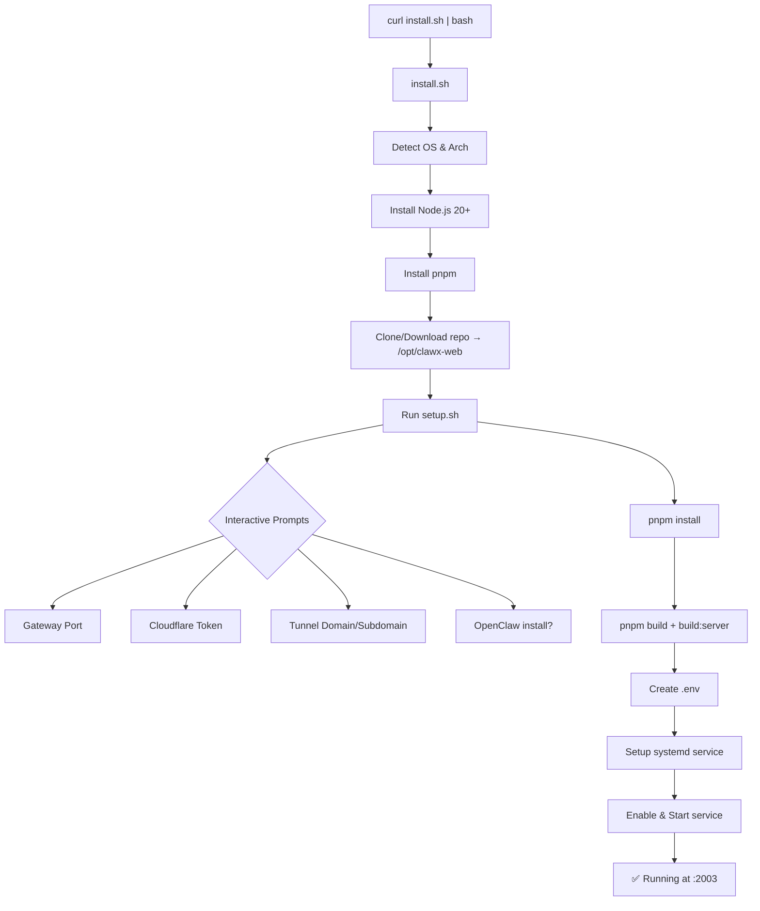

# PLAN: Linux Install & Setup Scripts

> One-line install + interactive setup cho ClawX-Web trên Ubuntu/Linux.

---

## Mục tiêu

Tạo hệ thống deploy ClawX-Web lên Ubuntu/Linux VPS chỉ với **1 lệnh**:

```bash
curl -fsSL https://raw.githubusercontent.com/your-repo/clawx-web/main/install.sh | bash
```

Sau khi cài, user có thể reconfigure bất kỳ lúc nào:

```bash
cd /opt/clawx-web && ./setup.sh
```

---

## Kiến trúc



---

## Deliverables

| File | Mục đích |
|---|---|
| `install.sh` | One-liner: detect OS, cài deps, clone repo, gọi setup.sh |
| `setup.sh` | Interactive: config .env, build, systemd, start |
| `clawx.service` | Systemd unit template |
| `uninstall.sh` | Gỡ cài đặt sạch |

---

## Task Breakdown

### Phase 1: `install.sh` — Bootstrapper

- [ ] Detect OS (Ubuntu 20/22/24, Debian 11/12) + Arch (x64/arm64)
- [ ] Kiểm tra và cài Node.js 20+ (via NodeSource)
- [ ] Cài pnpm globally
- [ ] Cài git nếu chưa có
- [ ] Clone repo vào `/opt/clawx-web` (hoặc download tarball)
- [ ] Tạo user `clawx` (non-root service user)
- [ ] Gọi `setup.sh` tự động

### Phase 2: `setup.sh` — Interactive Setup

- [ ] Detect mode: `--install` (first time) hoặc `--update` (reconfigure)
- [ ] Interactive prompts với defaults:
  - Gateway port (default: `18789`)
  - Cloudflare API Token (optional)
  - Tunnel domain (optional)
  - Tunnel subdomain (optional)
  - Cài OpenClaw Gateway? (y/n)
- [ ] Generate `.env` từ input
- [ ] `pnpm install --frozen-lockfile`
- [ ] `pnpm build && pnpm build:server`
- [ ] Copy `clawx.service` template → `/etc/systemd/system/`
- [ ] `systemctl daemon-reload && systemctl enable --now clawx`
- [ ] Print status + URL

### Phase 3: `clawx.service` — Systemd Unit

- [ ] Chạy dưới user `clawx`
- [ ] WorkingDirectory: `/opt/clawx-web`
- [ ] Restart on failure (delay 5s)
- [ ] Environment: `NODE_ENV=production`
- [ ] Stdout/stderr → journal

### Phase 4: `uninstall.sh` — Cleanup

- [ ] Stop & disable service
- [ ] Remove systemd unit
- [ ] Remove `/opt/clawx-web`
- [ ] Remove user `clawx` (optional)
- [ ] Giữ lại `.env` backup

### Phase 5: Convenience Commands

- [ ] `setup.sh --update` — git pull + rebuild + restart
- [ ] `setup.sh --status` — systemd status + URLs
- [ ] `setup.sh --logs` — journalctl -u clawx -f

---

## Chi tiết kỹ thuật

### `install.sh` Flow

```bash
#!/bin/bash
set -euo pipefail

# Colors
RED='\033[0;31m'; GREEN='\033[0;32m'; YELLOW='\033[1;33m'; NC='\033[0m'

# 1. Check root
[[ $EUID -ne 0 ]] && echo "Run as root: sudo bash install.sh" && exit 1

# 2. Detect OS
. /etc/os-release
[[ "$ID" != "ubuntu" && "$ID" != "debian" ]] && echo "Unsupported OS" && exit 1

# 3. Install Node.js 20
curl -fsSL https://deb.nodesource.com/setup_20.x | bash -
apt-get install -y nodejs git

# 4. Install pnpm
npm i -g pnpm

# 5. Clone
git clone https://github.com/your-repo/clawx-web.git /opt/clawx-web

# 6. Create user
useradd -r -s /bin/false -d /opt/clawx-web clawx 2>/dev/null || true
chown -R clawx:clawx /opt/clawx-web

# 7. Run setup
cd /opt/clawx-web && bash setup.sh --install
```

### `setup.sh` Prompt Flow

```
┌─────────────────────────────────────────┐
│  🦀 ClawX-Web Setup v0.1.15            │
├─────────────────────────────────────────┤
│                                         │
│  Gateway Port [18789]:                  │
│  Cloudflare API Token [skip]:           │
│  Tunnel Domain [skip]:                  │
│  Tunnel Subdomain [skip]:               │
│  Install OpenClaw? [Y/n]:               │
│                                         │
│  Building... ████████████ 100%          │
│  ✅ ClawX-Web running at :2003          │
│  🌐 Tunnel: https://xxx.domain.com     │
│                                         │
└─────────────────────────────────────────┘
```

### `clawx.service` Template

```ini
[Unit]
Description=ClawX-Web Dashboard
After=network.target
Wants=network-online.target

[Service]
Type=simple
User=clawx
WorkingDirectory=/opt/clawx-web
ExecStart=/usr/bin/node dist-server/index.js
Restart=on-failure
RestartSec=5
Environment=NODE_ENV=production
StandardOutput=journal
StandardError=journal

[Install]
WantedBy=multi-user.target
```

---

## Verification

- [ ] Test trên Ubuntu 22.04 fresh VPS (DigitalOcean/Vultr)
- [ ] Test trên Ubuntu 24.04
- [ ] Test trên Debian 12
- [ ] Test `--update` flow (git pull + rebuild)
- [ ] Test `uninstall.sh`
- [ ] Test auto-restart sau reboot
- [ ] Test tunnel hoạt động sau install

---

## Timeline

| Phase | Effort | Priority |
|---|---|---|
| `install.sh` | ~1h | P0 |
| `setup.sh` | ~2h | P0 |
| `clawx.service` | ~15min | P0 |
| `uninstall.sh` | ~30min | P1 |
| Convenience commands | ~30min | P2 |
| Testing | ~1h | P0 |

**Total: ~5h**
