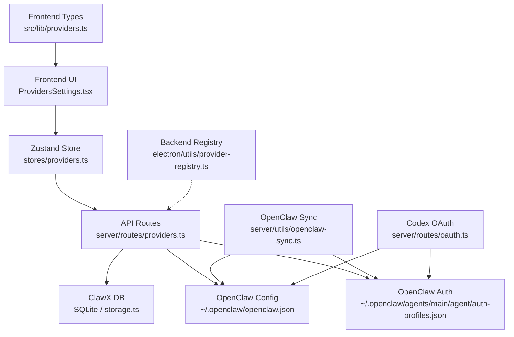
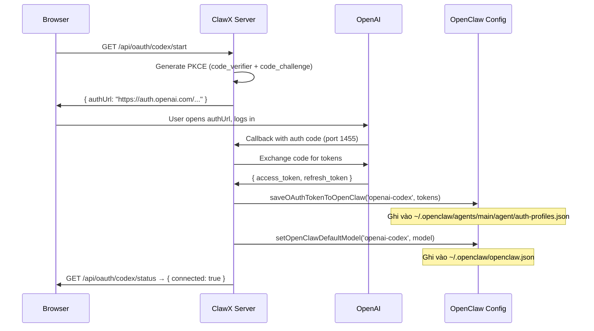

# Provider Architecture

> Tổng quan hệ thống Provider trong ClawX-Web — cách các AI provider (OpenAI, Anthropic, Google, Codex...) được đăng ký, lưu trữ, đồng bộ và hiển thị trên giao diện.

---

## Tổng quan các layer



---

## 1. Backend Registry — `electron/utils/provider-registry.ts`

Chứa metadata cho từng provider: env var name, default model, và config để sync sang OpenClaw.

### `BUILTIN_PROVIDER_TYPES`

```typescript
['anthropic', 'openai', 'google', 'openrouter', 'moonshot', 'siliconflow', 'ollama']
```

### REGISTRY

| Provider     | Env Var                  | Default Model                          | Có `providerConfig`? |
|-------------|--------------------------|----------------------------------------|:--------------------:|
| anthropic    | `ANTHROPIC_API_KEY`      | `anthropic/claude-opus-4-6`            | ❌ (built-in)        |
| openai       | `OPENAI_API_KEY`         | `openai/gpt-5.2`                      | ✅                   |
| google       | `GEMINI_API_KEY`         | `google/gemini-3-pro-preview`          | ❌ (built-in)        |
| openrouter   | `OPENROUTER_API_KEY`     | `openrouter/anthropic/claude-opus-4.6` | ✅                   |
| moonshot     | `MOONSHOT_API_KEY`       | `moonshot/kimi-k2.5`                   | ✅                   |
| siliconflow  | `SILICONFLOW_API_KEY`    | `siliconflow/deepseek-ai/DeepSeek-V3`  | ✅                   |
| 9router      | `NINEROUTER_API_KEY`     | `9router/cc/claude-opus-4-6`           | ✅                   |
| groq         | `GROQ_API_KEY`           | —                                      | ❌                   |
| deepgram     | `DEEPGRAM_API_KEY`       | —                                      | ❌                   |
| cerebras     | `CEREBRAS_API_KEY`       | —                                      | ❌                   |
| xai          | `XAI_API_KEY`            | —                                      | ❌                   |
| mistral      | `MISTRAL_API_KEY`        | —                                      | ❌                   |

> [!NOTE]
> - `siliconflow`, `groq`, `deepgram`, `cerebras`, `xai`, `mistral` có trong backend registry nhưng **không** có trong frontend `PROVIDER_TYPES`.
> - `codex` có trong frontend nhưng **không** có trong registry này (chỉ có trong `openclaw-sync.ts`).
> - `ollama` có trong cả `BUILTIN_PROVIDER_TYPES` và frontend, nhưng **không** có entry trong REGISTRY (không có env var hay default model).

### Exported functions

| Function                       | Mô tả                                                       |
|-------------------------------|--------------------------------------------------------------|
| `getProviderEnvVar(type)`     | Trả env var name (`ANTHROPIC_API_KEY`, ...)                  |
| `getProviderDefaultModel(type)`| Trả default model string                                    |
| `getProviderConfig(type)`     | Trả `providerConfig` (baseUrl, api, apiKeyEnv, models)       |
| `getKeyableProviderTypes()`   | Trả list provider types có env var (dùng để inject env vào gateway) |

---

## 2. Frontend Types — `src/lib/providers.ts`

### `PROVIDER_TYPES`

```typescript
['anthropic', 'openai', 'codex', 'google', 'openrouter', 'moonshot', 'ollama', '9router', 'custom']
```

### `PROVIDER_TYPE_INFO` (UI metadata)

| Provider   | Tên hiển thị    | requiresApiKey | useOAuth | canFetchModels | defaultModelId          |
|-----------|-----------------|:--------------:|:--------:|:--------------:|-------------------------|
| anthropic  | Anthropic       | ✅             | ❌       | ✅             | `claude-sonnet-4-20250514` |
| openai     | OpenAI          | ✅             | ❌       | ✅             | `gpt-4.1`               |
| codex      | Codex (OpenAI)  | ❌             | ✅       | ✅             | `gpt-5.3-codex`         |
| google     | Google          | ✅             | ❌       | ✅             | `gemini-2.5-flash`      |
| openrouter | OpenRouter      | ✅             | ❌       | ✅             | —                       |
| moonshot   | Kimi            | ✅             | ❌       | ❌             | `kimi-for-coding`       |
| ollama     | Ollama          | ❌             | ❌       | ✅             | —                       |
| 9router    | 9Router         | ✅             | ❌       | ✅             | `cc/claude-opus-4-6`    |
| custom     | Custom          | ✅             | ❌       | ❌             | —                       |

---

## 3. API Routes — `server/routes/providers.ts`

| Method   | Endpoint                             | Mô tả                                      |
|----------|--------------------------------------|---------------------------------------------|
| `GET`    | `/api/providers`                     | List tất cả providers (kèm `hasKey`, `keyMasked`) |
| `GET`    | `/api/providers/models/:type`        | Fetch available models từ provider API      |
| `POST`   | `/api/providers`                     | Lưu provider config + sync key/model sang OpenClaw |
| `DELETE` | `/api/providers/:id`                 | Xóa provider                                |
| `POST`   | `/api/providers/import-from-openclaw`| Import providers từ `~/.openclaw` config     |
| `POST`   | `/api/providers/default`             | Set default provider                         |
| `GET`    | `/api/providers/default`             | Get default provider                         |
| `GET`    | `/api/providers/codex/accounts`      | List Codex multi-account                     |
| `DELETE` | `/api/providers/codex/accounts`      | Xóa Codex account                            |

### Fetch Models hỗ trợ

Route `GET /api/providers/models/:type` hỗ trợ fetch models cho:
- **Ollama**: `GET http://localhost:11434/api/tags`
- **Anthropic**: `GET https://api.anthropic.com/v1/models`
- **Google**: `GET https://generativelanguage.googleapis.com/v1beta/models`
- **Codex (OpenAI)**: `GET https://api.openai.com/v1/models` (filter codex/gpt-5 models)
- **OpenAI-compatible**: Dùng baseUrl + `/models`

---

## 4. Zustand Store — `src/stores/providers.ts`

```typescript
interface ProviderState {
  providers: ProviderWithKeyInfo[];
  defaultProviderId: string | null;
  loading: boolean;
  error: string | null;
  currentModel: { model, provider, modelId } | null;

  // Actions
  fetchProviders(): Promise<void>;
  refreshCurrentModel(): Promise<void>;
  addProvider(config, apiKey?): Promise<void>;
  updateProvider(providerId, updates, apiKey?): Promise<void>;
  deleteProvider(providerId): Promise<void>;
  setApiKey(providerId, apiKey): Promise<void>;
  updateProviderWithKey(providerId, updates, apiKey?): Promise<void>;
  deleteApiKey(providerId): Promise<void>;
  setDefaultProvider(providerId): Promise<void>;

  // TODO - chưa implement
  validateApiKey(providerId, apiKey, options?): Promise<{ valid: boolean }>;  // luôn trả { valid: true }
  getApiKey(providerId): Promise<string | null>;                             // luôn trả null
}
```

> [!WARNING]
> Store **không** có `importFromOpenClaw()` hay `fetchCurrentModel()`. Import được gọi trực tiếp qua `api.importFromOpenClaw()` trong component. Refresh model dùng `refreshCurrentModel()`.

---

## 5. Codex OAuth Flow — Luồng đặc biệt

> [!IMPORTANT]
> Codex **KHÔNG** đi qua ClawX DB (`saveProvider` / `getApiKey`). Nó lưu **trực tiếp** vào OpenClaw config files.

### Flow diagram



### Files được ghi

| File                                                          | Nội dung                    |
|--------------------------------------------------------------|-----------------------------|
| `~/.openclaw/agents/main/agent/auth-profiles.json`           | OAuth tokens (access + refresh) |
| `~/.openclaw/openclaw.json`                                  | Default model + provider config |

### Codex multi-account

Mỗi account lưu dưới dạng profile riêng trong `auth-profiles.json`:

```
openai-codex:default          → account mặc định
openai-codex:user@email.com   → account theo email
```

---

## 6. OpenClaw Sync — `server/utils/openclaw-sync.ts`

Module trung gian đồng bộ provider config giữa ClawX-Web và OpenClaw Gateway. Có **REGISTRY riêng** tách biệt với `provider-registry.ts`.

### Registry riêng (openclaw-sync)

Chỉ 2 provider cần alias (`openclawId` khác với tên ClawX):

| ClawX Type | `openclawId`    | Default Model                  | Ghi chú              |
|-----------|-----------------|--------------------------------|-----------------------|
| moonshot   | `kimi-coding`   | `kimi-coding/kimi-for-coding`  | OpenClaw dùng tên khác |
| codex      | `openai-codex`  | `openai-codex/gpt-5.3-codex`  | Alias cho OAuth flow  |

Tất cả provider còn lại (anthropic, openai, google, openrouter, 9router) giữ nguyên tên, **KHÔNG** có `openclawId`.

### Exported functions

| Function                              | Mô tả                                                          |
|---------------------------------------|-----------------------------------------------------------------|
| `getProviderKeyFromOpenClaw(provider)` | Đọc API key từ `auth-profiles.json`                            |
| `getProviderKeyFromEnv(providerType)`  | Đọc API key từ environment variable                            |
| `getProviderConfigFromOpenClaw(type)`  | Đọc provider config từ `openclaw.json → models.providers`      |
| `saveProviderKeyToOpenClaw(provider, apiKey)` | Ghi API key vào `auth-profiles.json` (type: `api_key`) |
| `removeProviderKeyFromOpenClaw(provider)`     | Xóa API key khỏi `auth-profiles.json`                  |
| `setOpenClawDefaultModel(provider, model)`    | Set default model trong `openclaw.json`                 |
| `saveOAuthTokenToOpenClaw(provider, tokens)`  | Ghi OAuth tokens vào `auth-profiles.json`               |
| `getOAuthTokenFromOpenClaw(provider)` | Đọc OAuth tokens từ `auth-profiles.json`                       |
| `listOAuthProfiles(provider)`         | List tất cả OAuth profiles cho provider                         |
| `removeOAuthProfile(provider, id)`    | Xóa 1 OAuth profile                                            |

> [!WARNING]
> **Duplicate Registry:** `provider-registry.ts` (Electron) và `openclaw-sync.ts` (Server) có registry riêng biệt với config khác nhau (vd: moonshot dùng `moonshot/kimi-k2.5` ở registry vs `kimi-coding/kimi-for-coding` ở sync). Cần đồng bộ khi thêm/sửa provider.

---

## Vấn đề đã nhận thấy

### 1. Mismatch Frontend ↔ Backend

| Provider    | Frontend | Backend Registry | OpenClaw Sync |
|-------------|:--------:|:----------------:|:-------------:|
| codex       | ✅       | ❌               | ✅            |
| ollama      | ✅       | ✅ (`BUILTIN_PROVIDER_TYPES` only, không có REGISTRY entry) | ❌ |
| siliconflow | ❌       | ✅               | ❌            |
| groq        | ❌       | ✅               | ❌            |
| deepgram    | ❌       | ✅               | ❌            |
| cerebras    | ❌       | ✅               | ❌            |
| xai         | ❌       | ✅               | ❌            |
| mistral     | ❌       | ✅               | ❌            |

### 2. TODO chưa implement

- `validateApiKey()` — luôn trả `{ valid: true }`, chưa validate thật
- `getApiKey()` — luôn trả `null`, chưa đọc từ DB

### 3. Inconsistency default model Codex

Hai flow OAuth callback set default model **khác nhau**:

| Flow              | File            | Default Model         | Line |
|-------------------|-----------------|-----------------------|------|
| Auto callback     | `oauth.ts`      | `gpt-5.3-codex`       | 274  |
| Manual exchange   | `oauth.ts`      | `codex-mini-latest`   | 382  |

### 4. Duplicate Registry

`provider-registry.ts` (Electron) và `openclaw-sync.ts` (Server) có registry riêng biệt. Ví dụ moonshot:

| File                   | Provider Key | Default Model                  | baseUrl                           |
|------------------------|-------------|--------------------------------|-----------------------------------|
| `provider-registry.ts` | `moonshot`  | `moonshot/kimi-k2.5`           | `https://api.moonshot.cn/v1`      |
| `openclaw-sync.ts`     | `moonshot` (`openclawId: kimi-coding`) | `kimi-coding/kimi-for-coding` | `https://api.kimi.com/coding/v1` |

---

## Tóm tắt luồng dữ liệu

```
┌─────────────────────────────────────────────────────────┐
│  Provider thường (Anthropic, OpenAI, Google...)         │
│                                                         │
│  Frontend → API → ClawX DB + OpenClaw sync              │
│  (API key lưu cả 2 nơi)                                │
└─────────────────────────────────────────────────────────┘

┌─────────────────────────────────────────────────────────┐
│  Codex (OpenAI OAuth)                                   │
│                                                         │
│  Frontend → OAuth flow → OpenClaw ONLY                  │
│  (Token lưu trực tiếp vào auth-profiles.json)           │
│  (KHÔNG qua ClawX DB)                                   │
└─────────────────────────────────────────────────────────┘

┌─────────────────────────────────────────────────────────┐
│  Ollama (Local)                                         │
│                                                         │
│  Frontend → API → ClawX DB only                         │
│  (Không cần API key, không sync OpenClaw)               │
└─────────────────────────────────────────────────────────┘
```
